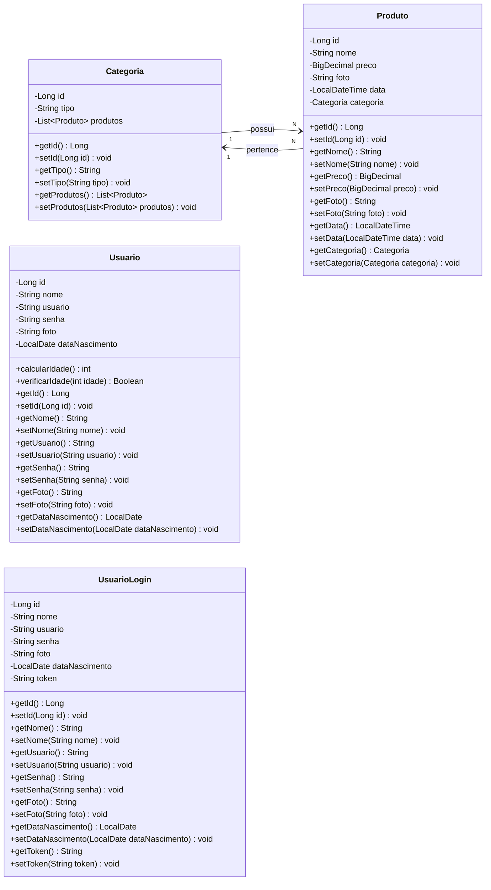
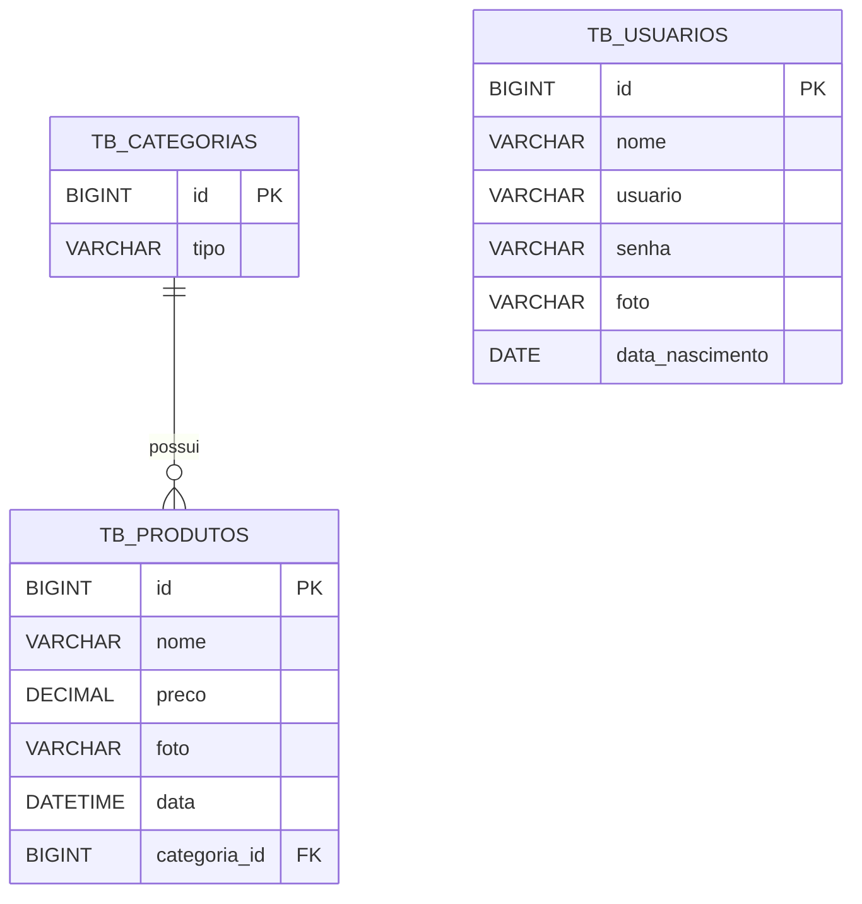

# Farmácia - Backend

<br />

<div align="center">
  
</div>

<br /><br />

## 1. Descrição

O **Farmácia - Backend** é uma API REST desenvolvida em Java com Spring Boot para gerenciar o fluxo de uma farmácia, permitindo o cadastro, consulta, atualização e exclusão de categorias, produtos e usuários. O projeto também implementa autenticação com Spring Security e JWT, garantindo mais segurança no acesso aos endpoints da aplicação.

------

## 2. Sobre esta API

Esta API foi construída com foco no desenvolvimento backend utilizando os principais conceitos de uma aplicação Java moderna, como organização em camadas, persistência de dados com JPA, validação de dados, relacionamento entre entidades e segurança com token. A aplicação está estruturada em pacotes como `controller`, `model`, `repository`, `service` e `security`, facilitando a manutenção, a escalabilidade e a separação de responsabilidades.

### 2.1. Principais Funcionalidades

1. Cadastro, listagem, atualização e remoção de categorias.
2. Cadastro, listagem, atualização e remoção de produtos.
3. Busca de categorias por tipo.
4. Busca de produtos por nome.
5. Busca de produtos por preço maior que um valor informado.
6. Busca de produtos por preço menor que um valor informado.
7. Cadastro de usuários.
8. Atualização de usuários.
9. Autenticação de usuários com login.
10. Geração de token JWT para acesso autenticado.
11. Proteção de rotas com Spring Security.
12. Validação de dados com Jakarta Validation.
13. Relacionamento entre categorias e produtos.

------

## 3. Diagrama de Classes

O sistema é composto principalmente pelas entidades `Categoria`, `Produto`, `Usuario` e pela classe auxiliar `UsuarioLogin`, utilizada no processo de autenticação.



------

## 4. Diagrama Entidade-Relacionamento (DER)

O banco de dados da aplicação é formado principalmente pelas tabelas `tb_categorias`, `tb_produtos` e `tb_usuarios`. O relacionamento existente entre `tb_categorias` e `tb_produtos` é de **um para muitos**, onde uma categoria pode possuir vários produtos, enquanto cada produto pertence a apenas uma categoria.



------

## 5. Tecnologias utilizadas

| Item                          | Descrição |
| ----------------------------- | --------- |
| **Servidor**                  | Tomcat |
| **Linguagem de programação**  | Java |
| **Framework**                 | Spring Boot |
| **ORM**                       | Spring Data JPA / Hibernate |
| **Banco de dados Relacional** | MySQL |
| **Segurança**                 | Spring Security |
| **Autenticação**              | JWT |
| **Validação**                 | Jakarta Validation |
| **Gerenciador de dependências** | Maven |

------

## 6. Estrutura do Projeto

A aplicação segue uma organização em camadas para separar melhor as responsabilidades de cada parte do sistema.

```bash
src/main/java/com/generation/farmacia
├── FarmaciaApplication.java
├── controller
│   ├── CategoriaController.java
│   ├── ProdutoController.java
│   └── UsuarioController.java
├── model
│   ├── Categoria.java
│   ├── Produto.java
│   ├── Usuario.java
│   └── UsuarioLogin.java
├── repository
│   ├── CategoriaRepository.java
│   ├── ProdutoRepository.java
│   └── UsuarioRepository.java
├── security
│   ├── JwtAuthFilter.java
│   ├── JwtService.java
│   ├── SecurityConfig.java
│   ├── UserDetailsImpl.java
│   └── UserDetailsServiceImpl.java
└── service
    └── UsuarioService.java
```

### 6.1. Organização das camadas

- `controller`: responsável por expor os endpoints da API.
- `model`: contém as entidades e classes de transferência utilizadas pela aplicação.
- `repository`: faz a comunicação com o banco de dados.
- `service`: concentra regras de negócio, principalmente no fluxo de usuário e autenticação.
- `security`: contém a configuração de segurança, filtro JWT e classes de autenticação.

------

## 7. Endpoints principais

### 7.1. Categoria

| Método | Endpoint | Descrição |
| ------ | -------- | --------- |
| GET | `/categorias` | Lista todas as categorias |
| GET | `/categorias/{id}` | Busca categoria por id |
| GET | `/categorias/tipo/{tipo}` | Busca categorias pelo tipo |
| POST | `/categorias` | Cadastra uma nova categoria |
| PUT | `/categorias` | Atualiza uma categoria |
| DELETE | `/categorias/{id}` | Remove uma categoria |

### 7.2. Produto

| Método | Endpoint | Descrição |
| ------ | -------- | --------- |
| GET | `/produtos` | Lista todos os produtos |
| GET | `/produtos/{id}` | Busca produto por id |
| GET | `/produtos/nome/{nome}` | Busca produtos pelo nome |
| GET | `/produtos/preco_maior/{preco}` | Busca produtos com preço maior que o valor informado |
| GET | `/produtos/preco_menor/{preco}` | Busca produtos com preço menor que o valor informado |
| POST | `/produtos` | Cadastra um novo produto |
| PUT | `/produtos` | Atualiza um produto |
| DELETE | `/produtos/{id}` | Remove um produto |

### 7.3. Usuário

| Método | Endpoint | Descrição |
| ------ | -------- | --------- |
| GET | `/usuarios/all` | Lista todos os usuários |
| GET | `/usuarios/{id}` | Busca usuário por id |
| POST | `/usuarios/cadastrar` | Cadastra um novo usuário |
| PUT | `/usuarios/atualizar` | Atualiza um usuário |
| POST | `/usuarios/logar` | Realiza autenticação e retorna o token |

------

## 8. Exemplo de JSON

### 8.1. Categoria

```json
{
  "tipo": "Medicamentos"
}
```

### 8.2. Produto

```json
{
  "nome": "Dipirona 1g",
  "preco": 15.99,
  "foto": "https://imagem.com/produto.jpg",
  "categoria": {
    "id": 1
  }
}
```

### 8.3. Usuário

```json
{
  "nome": "Joel Ramalho",
  "usuario": "joel@email.com",
  "senha": "12345678",
  "foto": "https://imagem.com/foto.jpg",
  "dataNascimento": "2000-05-10"
}
```

### 8.4. Login

```json
{
  "usuario": "joel@email.com",
  "senha": "12345678"
}
```

------

## 9. Segurança

A aplicação implementa uma camada de segurança com **Spring Security** e **JWT** para autenticação dos usuários. Após o login, o sistema gera um token que pode ser utilizado para acessar rotas protegidas da API.

A estrutura de segurança do projeto inclui classes específicas para configuração e autenticação:

- `SecurityConfig`
- `JwtService`
- `JwtAuthFilter`
- `UserDetailsImpl`
- `UserDetailsServiceImpl`

Esse modelo torna a autenticação mais segura e aproxima o projeto de uma estrutura utilizada em aplicações reais de mercado.

------

## 10. Regras de Negócio observadas

Algumas regras implementadas na aplicação:

- O `id` de categoria e produto é gerado automaticamente pelo banco.
- Um produto só pode ser cadastrado se a categoria informada existir.
- Um produto só pode ser atualizado se o produto existir e a categoria também existir.
- O usuário deve possuir email válido.
- A senha do usuário deve ter no mínimo 8 caracteres.
- A data de nascimento deve ser anterior à data atual.
- A aplicação possui validações com mensagens personalizadas nas entidades.

------

## 11. Configuração e Execução

### 11.1. Clonar o repositório

```bash
git clone https://github.com/JoelRamalhoF/projeto_final_bloco_02.git
```

### 11.2. Acessar a pasta do projeto

```bash
cd projeto_final_bloco_02
```

### 11.3. Configurar o banco de dados

Configure o arquivo `application.properties` ou `application.yml` com as informações do seu banco MySQL, como:

- URL do banco
- usuário
- senha
- porta
- dialeto do banco
- estratégia de atualização das tabelas

Exemplo:

```properties
spring.datasource.url=jdbc:mysql://localhost:3306/db_farmacia
spring.datasource.username=root
spring.datasource.password=sua_senha
spring.jpa.hibernate.ddl-auto=update
spring.jpa.show-sql=true
```

### 11.4. Executar a aplicação

No Linux ou Git Bash:

```bash
./mvnw spring-boot:run
```

No Windows:

```bash
mvnw.cmd spring-boot:run
```

### 11.5. Classe principal

```java
package com.generation.farmacia;

import org.springframework.boot.SpringApplication;
import org.springframework.boot.autoconfigure.SpringBootApplication;

@SpringBootApplication
public class FarmaciaApplication {

    public static void main(String[] args) {
        SpringApplication.run(FarmaciaApplication.class, args);
    }

}
```

------

## 12. Melhorias futuras

- Adicionar documentação com Swagger/OpenAPI.
- Criar testes unitários e testes de integração.
- Implementar níveis de acesso por perfil de usuário.
- Publicar a aplicação em ambiente de deploy.
- Adicionar tratamento global de exceções.
- Melhorar a documentação dos endpoints protegidos.

------

## 13. Autor

Desenvolvido por **Joel Ramalho**.

[GitHub - JoelRamalhoF](https://github.com/JoelRamalhoF)
